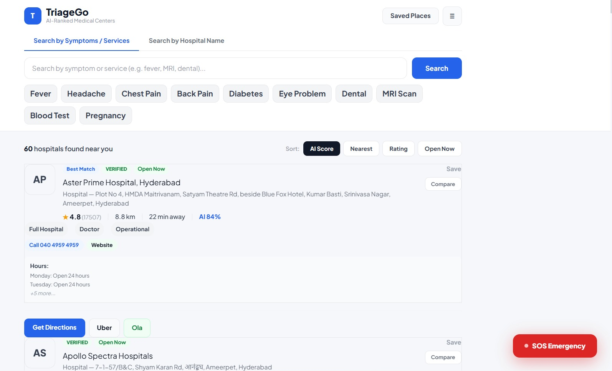
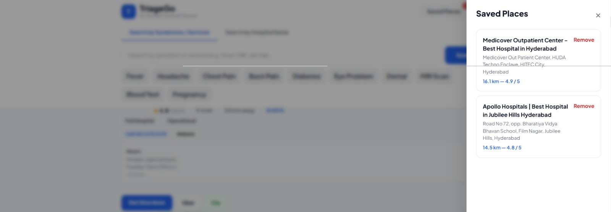
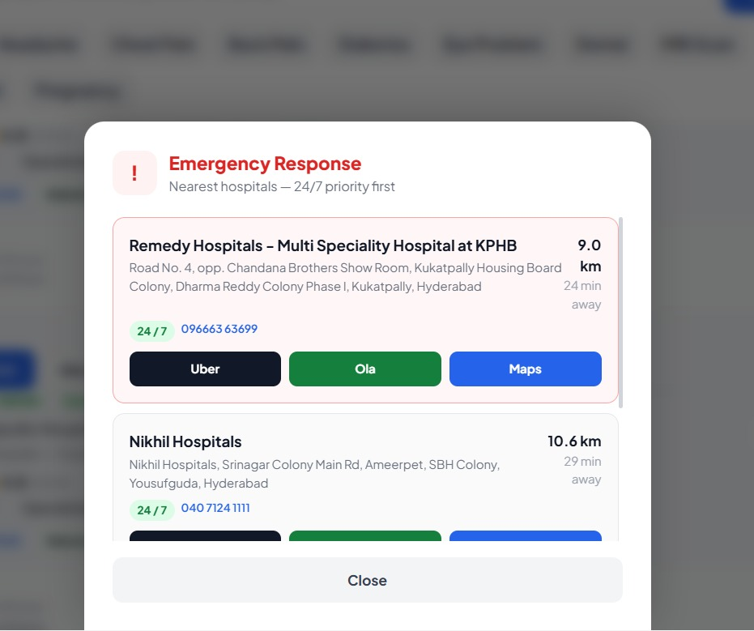

# MedCompare (TriageGo)

Lightweight, AI-assisted medical center discovery using Google Maps APIs.

This repository contains a FastAPI backend and a React + Vite frontend that together provide:
- Symptom/service search for nearby hospitals and diagnostic centers
- AI-based ranking and recommendations
- Contact details (phone, website, opening hours)
- SOS emergency endpoint that returns nearest 24/7 hospitals

Repo layout (high level)
- backend/         FastAPI backend and related services
- frontend/        React + Vite frontend

Quick start (development)

1) Set your Google Maps API key (recommended):

Windows (cmd):

```cmd
set GOOGLE_MAPS_API_KEY=your_key_here
```

PowerShell:

```powershell
$env:GOOGLE_MAPS_API_KEY = "your_key_here"
```

Linux / macOS:

```bash
export GOOGLE_MAPS_API_KEY=your_key_here
```

Or create a `backend/.env` file containing:

```
GOOGLE_MAPS_API_KEY=your_key_here
```

2) Start backend

```bash
cd backend
pip install -r requirements.txt
uvicorn api.main:app --reload --host 0.0.0.0 --port 8000
```

The backend exposes the API under `/api/v1`. Visit http://localhost:8000/docs for Swagger UI.

3) Start frontend

```bash
cd frontend
npm install
npm run dev
```

By default the frontend expects the backend at `http://localhost:8000/api/v1`.

API Endpoints (most relevant)
- POST /api/v1/search — search hospitals by symptoms or name
- POST /api/v1/sos — emergency quick-search for nearest hospitals
- POST /api/v1/contact-details — fetch phone/website/hours by place_id
- GET  /api/v1/debug — diagnostics and API-key check

Notes on API key handling
- The backend reads the Google Maps API key from the `GOOGLE_MAPS_API_KEY` environment variable. Avoid committing keys to source control.
- If you prefer a `.env` file, ensure your code loads it (python-dotenv) and add `.env` to `.gitignore`.

Local development tips
- If using a mobile device to test the frontend against your local dev server, set `frontend/src/constants/theme.jsx` or `config/api.js` to point to your machine IP (e.g. `http://192.168.1.8:8000/api/v1`) and ensure `uvicorn` is started with `--host 0.0.0.0`.
- Use the `/debug` endpoint to verify the Google API key and basic Google Maps calls from the backend.

Contributing
- Create a branch for your work, open a PR, and include tests or screenshots for UI changes.

Security
- Do not commit API keys or secrets. Use environment variables or a secrets manager.

License & acknowledgements
- This project uses Google Maps Platform (Places, Distance Matrix). Make sure your billing and quotas are set appropriately.

If you want, I can also add a minimal CI workflow (GitHub Actions) that runs lint/tests on push and a short CONTRIBUTING guide.

## Screenshots

Project screenshots


    

Each image is included from `frontend/src/assets/`. If you prefer different images or captions, tell me the filenames and captions and I will update them.

# 📚 MedCompare Project - Complete Documentation


---

## 📁 Project Structure

### Backend: `backend/api/`
```
api/
├── config/              # Configuration & Settings
│   ├── __init__.py
│   └── settings.py      # ⭐ All settings in one place
├── models/              # Request/Response Models
│   ├── __init__.py
│   └── requests.py      # Pydantic schemas
├── services/            # Business Logic & APIs
│   ├── __init__.py
│   ├── google_places.py         # Google Places API
│   ├── distance_service.py      # Distance Matrix API
│   └── hospital_formatter.py    # Format data
├── utils/               # Utility Functions
│   ├── __init__.py
│   ├── cache.py         # Caching
│   ├── geo.py           # Geographic calculations
│   ├── time_utils.py    # Time-based utilities
│   ├── scoring.py       # AI scoring
│   ├── formatting.py    # Data formatting
│   └── nlp_utils.py     # NLP & symptoms
├── routes.py            # ⭐ Clean API endpoints (200 lines)
├── schemas.py           # Model re-exports
└── main.py              # FastAPI setup
```

### Frontend: `frontend/src/`
```
src/
├── config/
│   └── api.js           # API configuration
├── services/
│   └── hospitalService.jsx      # API calls
├── utils/
│   └── formatDistance.jsx       # Utilities
├── components/          # Reusable components
├── screens/
│   ├── HomeScreen.jsx
│   ├── DetailsScreen.jsx        # ⭐ With contact details
│   └── ...
├── hooks/               # Custom hooks
├── stores/              # State management
└── layouts/             # Layout wrappers
```

---


### Contact Details Feature

**What's new:**
- ☎️ Hospital phone numbers (clickable to call)
- 🌐 Hospital websites (clickable links)
- 📋 Opening hours by day
- 📍 Complete address information

**Where it appears:**
- Search results include contact info
- SOS emergency hospitals show phone numbers
- Details screen displays full contact information

**API Endpoint:**
```
POST /api/v1/contact-details
Input: { "place_id": "..." }
Output: {
  "phone": "+91-...",
  "website": "https://...",
  "hours": ["Monday: 9AM-5PM", ...],
  "address": "..."
}
```

---

## 🚀 Getting Started

### 1️⃣ Set Up Google Maps API Key

Choose the method that works best for you:

**Option A: Environment Variable (Recommended)**
```cmd
# Windows CMD
set GOOGLE_MAPS_API_KEY=your_key_here

# Windows PowerShell
$env:GOOGLE_MAPS_API_KEY="your_key_here"

# Linux/Mac
export GOOGLE_MAPS_API_KEY=your_key_here
```

**Option B: .env File (Also Recommended)**
1. Create `backend/.env`
2. Add: `GOOGLE_MAPS_API_KEY=your_key_here`
3. Install: `pip install python-dotenv`
4. Update `backend/api/config/settings.py` with:
   ```python
   from dotenv import load_dotenv
   load_dotenv()
   ```

**Option C: Direct in settings.py (Testing Only)**
- Edit `backend/api/config/settings.py`
- Change: `GOOGLE_API_KEY = "your_key_here"`

📖 **See:** `API_KEY_SETUP.md` for detailed instructions

### 2️⃣ Start the Backend

```bash
cd backend
pip install -r requirements.txt
uvicorn api.main:app --reload --host 0.0.0.0 --port 8000
```

Expected output:
```
INFO:     Started server process
INFO:     Uvicorn running on http://0.0.0.0:8000
```

### 3️⃣ Start the Frontend

```bash
cd frontend
npm install
npm run dev
```

### 4️⃣ Test the API

```bash
# In your browser or API client:
http://localhost:8000/api/v1/debug?lat=17.385&lon=78.486
```

Should return:
```json
{
  "api_key_set": true,
  "api_key_preview": "AIzaSyJ...",
  "tests": {
    "nearby_hospital": {...},
    "text_search_apollo": {...},
    "distance_matrix": {...}
  }
}
```

---

## 📖 Documentation Files

1. **`PROJECT_ORGANIZATION.md`** - Detailed architecture explanation
2. **`CHANGES_SUMMARY.md`** - What changed and why
3. **`API_KEY_SETUP.md`** - How to set up your Google Maps API key
4. **`README.md`** - This file

---

## 🔄 Key Improvements

### Code Quality
- ✅ Modular architecture (15+ focused files)
- ✅ Single responsibility principle
- ✅ Easy to test and maintain
- ✅ Better error handling
- ✅ Centralized configuration

### Performance
- ✅ Efficient caching (5 min TTL)
- ✅ Optimized API calls
- ✅ Minimal processing overhead

### Features
- ✅ All original features preserved
- ✅ Contact details integration
- ✅ Clickable phone & website links
- ✅ Opening hours display
- ✅ Better UI organization

---

## 📊 What Stays the Same

Your original functionality is 100% preserved:

✅ Hospital search by symptoms  
✅ Hospital search by name  
✅ SOS emergency search  
✅ Heatmap visualization  
✅ AI recommendation scoring  
✅ NLP symptom mapping  
✅ Distance calculations  
✅ ETA calculations  
✅ Offline caching  
✅ All UI components  
✅ All styling  
✅ All navigation  

**Plus:** Contact details feature! 🎁

---

## 🛠️ API Endpoints

### Search Endpoints

**1. Hospital Search**
```
POST /api/v1/search
{
  "lat": 17.385,
  "lon": 78.486,
  "query": "fever",
  "mode": "symptoms"  // or "hospitals"
}
```

**2. Emergency SOS**
```
POST /api/v1/sos
{
  "lat": 17.385,
  "lon": 78.486
}
```

**3. Contact Details** ⭐ NEW
```
POST /api/v1/contact-details
{
  "place_id": "ChIJN1blonO8OxURCyKt7KhUNBE"
}
```

**4. Heatmap Data**
```
POST /api/v1/heatmap
{
  "lat": 17.385,
  "lon": 78.486,
  "query": "hospital"
}
```

**5. Debug**
```
GET /api/v1/debug?lat=17.385&lon=78.486
```
---

## 📱 Frontend Integration

### API Service (`services/hospitalService.jsx`)

```javascript
// Fetch hospitals
const data = await fetchHospitals(lat, lon, query, mode);

// Get emergency hospitals
const sos = await fetchSOS(lat, lon);

// Get contact details
const details = await fetchContactDetails(placeId);

// Get heatmap data
const heatmap = await fetchHeatmap(lat, lon, query);
```

### Details Screen (`screens/DetailsScreen.jsx`)

- Shows hospital name, address, rating
- Displays contact information
  - Phone (tap to call)
  - Website (tap to open)
  - Opening hours
- Shows distance, ETA, busy status
- Action buttons (Directions, Call, etc.)

---

## 🔐 Security

### Best Practices Implemented

1. **Environment Variables**
   - Never hardcode API keys
   - Use `.env` files or system environment variables

2. **API Key Restrictions**
   - Set in Google Cloud Console
   - Restrict to Places API only
   - Restrict to your domains

3. **Data Validation**
   - Pydantic models validate all inputs
   - Type checking on all endpoints

4. **Error Handling**
   - Graceful error responses
   - No sensitive data in errors
   - Proper HTTP status codes

---

## 🧪 Testing the Setup

### Backend Test
```bash
# Test if backend loads
python -c "from api.main import app; print('✅ Backend OK')"

# Or visit debug endpoint
curl http://localhost:8000/api/v1/debug
```

### Frontend Test
```bash
# Frontend should be running on
http://localhost:5173
```

### Full Flow Test
1. Search for a symptom (e.g., "fever")
2. Click on a hospital
3. Verify contact details display (phone, website, hours)
4. Click phone number to test calling
5. Click website to test link

---

## 📝 Configuration Reference

### Backend Configuration (`config/settings.py`)

```python
# API Keys
GOOGLE_API_KEY = os.getenv("GOOGLE_MAPS_API_KEY", "")

# API Endpoints
PLACES_NEARBY_URL = "https://maps.googleapis.com/maps/api/place/nearbysearch/json"
PLACES_TEXT_URL = "https://maps.googleapis.com/maps/api/place/textsearch/json"
DISTANCE_MATRIX_URL = "https://maps.googleapis.com/maps/api/distancematrix/json"
PLACES_DETAILS_URL = "https://maps.googleapis.com/maps/api/place/details/json"

# Cache
CACHE_TTL = 300  # 5 minutes

# Search Radius
DEFAULT_SEARCH_RADIUS = 10000  # meters
SOS_SEARCH_RADIUS = 15000
HEATMAP_SEARCH_RADIUS = 15000

# Limits
MAX_DESTINATIONS_PER_REQUEST = 25
```

### Frontend Configuration (`config/api.js`)

```javascript
export const API_BASE_URL = import.meta.env.VITE_API_URL || 'http://localhost:8000/api/v1';
export const APP_NAME = 'MedCompare AI';
export const APP_VERSION = '1.0.0';
export const CACHE_DURATION = 5 * 60 * 1000; // 5 minutes
```

---

## 🎯 Next Steps (Optional)

Ideas for future enhancements:

- [ ] Hospital favorites/bookmarks
- [ ] User reviews and ratings
- [ ] Appointment booking system
- [ ] Doctor search feature
- [ ] Multi-language support
- [ ] Insurance verification
- [ ] Telemedicine integration
- [ ] Real-time wait times
- [ ] Chat with hospital support
- [ ] Mobile app (React Native)

---

## ❓ Common Issues & Solutions

### Issue: `ModuleNotFoundError: No module named 'models'`
**Solution:** Make sure you're running from the `backend` directory and imports use `.` notation

### Issue: `GOOGLE_API_KEY not set`
**Solution:** See `API_KEY_SETUP.md` for setting up your API key

### Issue: `No hospitals found`
**Solution:** 
- Check your API key is valid
- Check your coordinates are correct
- Verify Places API is enabled in Google Cloud

### Issue: Frontend can't connect to backend
**Solution:**
- Make sure backend is running on `http://localhost:8000`
- Check CORS headers are correct in `main.py`
- Verify frontend `API_BASE_URL` matches backend URL

---

## 📞 Support Resources

1. **Google Maps API Docs**: https://developers.google.com/maps
2. **FastAPI Docs**: https://fastapi.tiangolo.com/
3. **React Docs**: https://react.dev/
4. **Your API Docs**: http://localhost:8000/docs (Swagger UI)

---


**Status:** ✅ Complete & Ready
